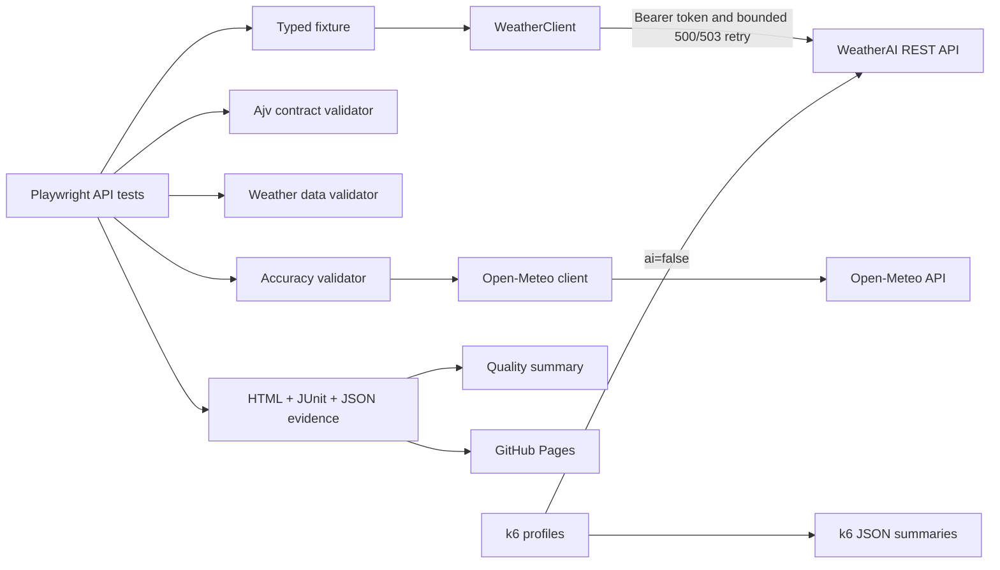

# WeatherAI AtmosGuard

[](https://github.com/Joseph-Mutua/weatherai-atmosguard/actions/workflows/api-tests.yml)
[](https://github.com/Joseph-Mutua/weatherai-atmosguard/actions/workflows/uptime-monitor.yml)

- [Live Playwright report](https://joseph-mutua.github.io/weatherai-atmosguard/)
- [CI runs](https://github.com/Joseph-Mutua/weatherai-atmosguard/actions)
- [WeatherAI documentation](https://weather-ai.co/docs)
- [Known issues](docs/KNOWN_ISSUES.md)

## Table of Contents

- [WeatherAI AtmosGuard](#weatherai-atmosguard)
  - [Table of Contents](#table-of-contents)
  - [1. Overview](#1-overview)
  - [2. Objectives](#2-objectives)
  - [3. Architecture](#3-architecture)
  - [4. Technology stack](#4-technology-stack)
  - [5. APIs covered](#5-apis-covered)
  - [6. Test strategy](#6-test-strategy)
  - [7. Project structure](#7-project-structure)
  - [8. Prerequisites](#8-prerequisites)
  - [9. Installation](#9-installation)
  - [10. Environment configuration](#10-environment-configuration)
  - [11. Run all tests](#11-run-all-tests)
  - [12. Run individual suites](#12-run-individual-suites)
  - [13. Performance testing](#13-performance-testing)
  - [14. Reports](#14-reports)
  - [15. CI/CD](#15-cicd)
  - [16. GitHub Pages](#16-github-pages)
  - [17. API quota considerations](#17-api-quota-considerations)
  - [18. Engineering decisions](#18-engineering-decisions)
  - [19. Assumptions](#19-assumptions)
  - [20. Observed behavior and documentation discrepancies](#20-observed-behavior-and-documentation-discrepancies)
  - [21. Known limitations](#21-known-limitations)
  - [22. Future improvements](#22-future-improvements)

Supporting documents: [Test strategy](docs/TEST_STRATEGY.md) ·
[Automated test cases](docs/TEST_CASES.md) · [Known issues register](docs/KNOWN_ISSUES.md)

## 1. Overview

`weatherai-atmosguard` is an API-only TypeScript quality engineering framework for the
[WeatherAI developer API](https://weather-ai.co/docs). Playwright's `APIRequestContext` drives
functional and synthetic checks, Ajv enforces tolerant JSON contracts, Open-Meteo supplies an
independent anomaly signal, and k6 owns controlled performance testing. No browser automation is
used.

## 2. Objectives

- Detect functional, authentication, authorization, contract, and boundary regressions.
- Validate weather-domain invariants and consistency across delegated endpoints.
- Identify material cross-provider divergence without treating a reference provider as truth.
- Enforce candidate-defined latency budgets and quota-conscious synthetic monitoring.
- Produce reviewable human and machine-readable evidence locally and in CI.
- Keep functional correctness testing separate from controlled load generation.

## 3. Architecture



## 4. Technology stack

- Node.js 20+
- Strict TypeScript with unchecked-index and exact-optional checks
- Playwright Test and `APIRequestContext`
- Ajv JSON Schema validation
- k6 load generation
- ESLint flat config and Prettier
- GitHub Actions, GitHub Pages, HTML, JUnit XML, JSON, and workflow artifacts

## 5. APIs covered

Authenticated WeatherAI coverage includes:

- `GET /v1/weather`
- `GET /v1/forecast`
- `GET /v1/current`
- `GET /v1/daily`
- `GET /v1/hourly`
- `GET /v1/weather-geo` with deterministic coordinate overrides
- `GET /v1/usage` contract and quota semantics
- `GET /v1/forecast14` plan-aware authorization

The accuracy suite also calls Open-Meteo `GET /v1/forecast` for comparable current temperature,
relative humidity, and wind-speed reference data. Humidity is compared only when WeatherAI exposes
the corresponding field.

## 6. Test strategy

Tests are data-driven and tagged `@unit`, `@smoke`, `@functional`, `@contract`, `@negative`,
`@security`, `@data-quality`, `@accuracy`, and `@monitoring`. Stable shape and domain rules are
strict; dynamic weather values use tolerances or invariants. Additional response properties remain
allowed because the public API does not promise a closed contract.

The retry policy is deliberately narrow: at most three attempts with 500 ms and 1,000 ms delays,
only for HTTP `500` and `503`. It never retries `400`, `401`, `403`, assertions, or domain failures.
The uptime check additionally requires `attempts === 1`, preventing a recovered server error from
being reported as uninterrupted availability.

CI treats retries as diagnostic evidence rather than a way to hide instability:
`failOnFlakyTests` is enabled in CI, and the custom quality summary reports flaky tests and retry
attempts separately. Response and accuracy thresholds are intentionally conservative regression
guards designed to distinguish severe degradation from normal Internet and shared-runner variance;
they do not reproduce WeatherAI's plan-specific SLA claims.

See [TEST_STRATEGY.md](docs/TEST_STRATEGY.md) and [TEST_CASES.md](docs/TEST_CASES.md).

## 7. Project structure

```text
config/                    environment and candidate-defined thresholds
src/clients/               WeatherAI and Open-Meteo API clients
src/fixtures/              initialized Playwright WeatherClient fixture
src/models/                request/response/error types
src/schemas/               tolerant observed JSON Schemas
src/test-data/             precise global coordinates
src/utils/                 retry, timing, and redacting logger utilities
src/validators/            contract, domain, accuracy, error, and rate-limit rules
tests/                     API suites grouped by quality concern
performance/               k6 smoke/load/stress/spike profiles
k6-results/                ignored generated summaries; tracked directory placeholder
scripts/                   evidence-based quality-summary generator
docs/                      strategy, case catalog, and known-issue register
.github/workflows/         API CI, performance smoke, uptime, and Pages deployment
```

## 8. Prerequisites

- Node.js 20 or newer and npm
- A WeatherAI API key
- k6 1.x for local performance execution
- GitHub repository secret `WEATHER_AI_API_KEY` for live CI

## 9. Installation

```bash
git clone https://github.com/Joseph-Mutua/weatherai-atmosguard.git
cd weatherai-atmosguard
npm ci
```

`npm ci` is the supported deterministic installation and is also used by CI.

## 10. Environment configuration

Copy `.env.example` to `.env` and replace only the placeholder:

```dotenv
WEATHER_AI_API_KEY=wai_your_key_here
WEATHER_AI_BASE_URL=https://api.weather-ai.co
WEATHER_AI_PLAN=free
```

`.env` and every `.env.*` variant except `.env.example` are ignored. The client reads the key only
from `process.env.WEATHER_AI_API_KEY`; the base URL defaults to `https://api.weather-ai.co`.
Supported plan values are `free`, `pro`, and `scale`.

Optional variables include `SMOKE_RESPONSE_BUDGET_MS`, `FUNCTIONAL_RESPONSE_BUDGET_MS`,
`MONITORING_RESPONSE_BUDGET_MS`, retry settings, and accuracy tolerances. Defaults live in
`config/thresholds.ts` and are candidate-defined quality gates—not WeatherAI production SLAs.

## 11. Run all tests

```bash
npm test
```

The safe default leaves AI validation skipped, sets `ai=false` on routine live calls, and does not
execute load, stress, or spike profiles. Enable the two dedicated language/AI tests only when quota
permits:

```bash
RUN_AI_TESTS=true npm run test:functional
```

In PowerShell, run `$env:RUN_AI_TESTS='true'` before the npm command.

## 12. Run individual suites

```bash
npm run test:unit
npm run test:smoke
npm run test:functional
npm run test:contract
npm run test:negative
npm run test:data-quality
npm run test:consistency
npm run test:accuracy
npm run test:monitor
npm run format:check
npm run lint
npm run typecheck
```

The Playwright tests use the exported fixture as `async ({ weatherClient }) => { ... }` and do not
duplicate authentication or raw request construction.

## 13. Performance testing

The automatic profile makes exactly one request:

```bash
npm run perf:smoke
```

k6 reads `WEATHER_AI_API_KEY` and `WEATHER_AI_BASE_URL` from its process environment. Load, stress,
and spike are manual and additionally require `ALLOW_HIGH_VOLUME=true`:

```bash
ALLOW_HIGH_VOLUME=true npm run perf:load
ALLOW_HIGH_VOLUME=true npm run perf:stress
ALLOW_HIGH_VOLUME=true npm run perf:spike
```

PowerShell example:

```powershell
$env:ALLOW_HIGH_VOLUME='true'
npm run perf:load
```

The guard error is intentional. Set it only after API-owner authorization and quota confirmation.
Every profile uses `ai=false` and checks echoed coordinates, horizon, units, finite current
temperature and wind speed, non-negative wind speed, and non-empty daily/hourly forecasts. The
one-sample smoke uses a candidate-defined `max<5000` latency gate; sustained profiles use
candidate-defined p95 and p99 gates. Each run writes `k6-results/<profile>-summary.json`.
Playwright is intentionally not used as a load generator.

## 14. Reports

Normal Playwright execution produces:

- `playwright-report/index.html`
- `test-results/results.xml`
- `test-results/results.json`
- `k6-results/<profile>-summary.json` for an executed k6 profile

Open the HTML report with `npm run test:report`. Generate `quality-report.json` from an actual
Playwright JSON run with `npm run report:summary`. The summary derives pass/fail/skip counts,
flaky count, retry attempts, test-duration average and p95, executed endpoints/locations, violation
counts, and comparison attachment count. It never invents missing measurements. Accuracy
comparison evidence is attached on both passing runs and tolerance failures.

## 15. CI/CD

`.github/workflows/api-tests.yml` runs deterministic installation, formatting, lint, type checking,
unit tests, each safe live suite, merged reporting, the quality summary, and the one-request k6
smoke. With a configured key, CI requires exactly eight blob reports—unit plus seven live suites—
before merging. Without a key, it still merges and publishes unit-test evidence. HTML,
machine-readable results, and k6 JSON are downloadable artifacts.

The main quality pipeline is the sole automatic owner of the one-request k6 smoke. The separate
performance workflow is manual-only, preventing a performance-file push from consuming the same
request twice. A failed report merge remains a CI failure; evidence steps still use `always()` where
appropriate.

Fork pull requests do not receive secrets. They still run static quality gates and unit tests while
safely skipping live API calls. AI checks remain opt-in through the `run_ai_tests` manual-dispatch
checkbox.

The uptime workflow runs once daily and also validates pushes that change its workflow or monitoring
test. This gives the uptime badge an initial result without spending quota on every repository push.

## 16. GitHub Pages

On a push to `main`, any successfully generated merged `playwright-report/` is deployed—even when
API assertions failed—so Pages preserves failure evidence. Deployment is skipped only when the
report cannot be generated or the live-test secret is unavailable.

Live report: https://joseph-mutua.github.io/weatherai-atmosguard/

## 17. API quota considerations

The Free plan documents 1,000 total and 200 AI requests per rolling 30-day subscription period.
Routine tests use `ai=false`; AI cases are explicit opt-ins. Daily monitoring makes one request.
The framework never attempts to exhaust quota to force `429`, and high-volume profiles cannot start
without a second authorization flag.

The absence of a `429` exhaustion test is intentional to avoid consuming the remaining shared
monthly quota.

## 18. Engineering decisions

- **Playwright:** API contexts, typed fixtures, parameterization, steps, attachments, and first-class
  HTML/JUnit reporting suit functional API evidence.
- **k6:** VU scheduling and latency/failure-rate thresholds avoid misusing a functional runner for
  load.
- **Ajv:** explicit, tolerant JSON Schema checks provide useful multi-error diagnostics.
- **`ai=false`:** routine checks do not spend the finite Gemini request allowance.
- **Tolerance-based reference checks:** providers use different models and update cycles; exact
  equality would be scientifically and operationally unsound.
- **No automatic destructive load:** public quota and service availability outweigh demonstration
  volume.
- **Environment-only secrets:** credentials stay in local environment files and GitHub Secrets;
  redacting logs provide a second defensive layer.

## 19. Assumptions

- `WEATHER_AI_PLAN` accurately describes the key under test.
- Metric WeatherAI wind speed and explicitly requested Open-Meteo wind speed are both km/h.
- Timestamp strings without offsets represent the requested location's local time; Open-Meteo uses
  `timezone=auto` for alignment.
- Public weather values can change between sequential calls, so comparisons use stable fields and
  tolerances.

## 20. Observed behavior and documentation discrepancies

Low-volume requests on 2026-08-19 observed:

- Successful responses omitted all documented `X-RateLimit-*` headers. Tests validate a complete,
  valid set when any header is exposed but do not fail when the whole set is absent.
- `/v1/current`, `/v1/daily`, and `/v1/hourly` returned the same composite shape as `/v1/weather`,
  consistent with the documented shared handler.
- Coordinates outside geographic bounds returned `502` with a generic upstream error, not `400`.
- Empty coordinate strings were coerced to zero and returned `200`.
- `days=0`, negative, oversized, and text values normalized to `7`, `1`, `7`, and `7`.
- A seven-day response contained seven daily rows but only 48 hourly rows. Checks require chronology
  and inclusion within the daily horizon; they do not invent a `24 × days` contract.

The maintained status, risk, and automated evidence is in
[docs/KNOWN_ISSUES.md](docs/KNOWN_ISSUES.md). These observations are evidence, not endorsements of
the behavior.

## 21. Known limitations

- WeatherAI did not expose humidity in the sampled response, so cross-provider humidity comparison
  is conditional.
- No quota-exhaustion/`429` test runs against the shared public API.
- AI language behavior is outside safe default execution.
- Forecast accuracy thresholds are anomaly heuristics, not meteorological acceptance guarantees.
- External provider availability can affect accuracy comparison results.

## 22. Future improvements

- Run contract snapshots against a dedicated non-production tenant with versioned fixtures.
- Export timing and quality events to a time-series dashboard with alert routing.
- Add provider/model-aware accuracy baselines over rolling windows and seasons.
- Add a controlled mock environment for deterministic `429`, `500`, and `503` verification.
- Add an authorized multi-plan CI matrix for Free, Pro, and Scale behavior.
