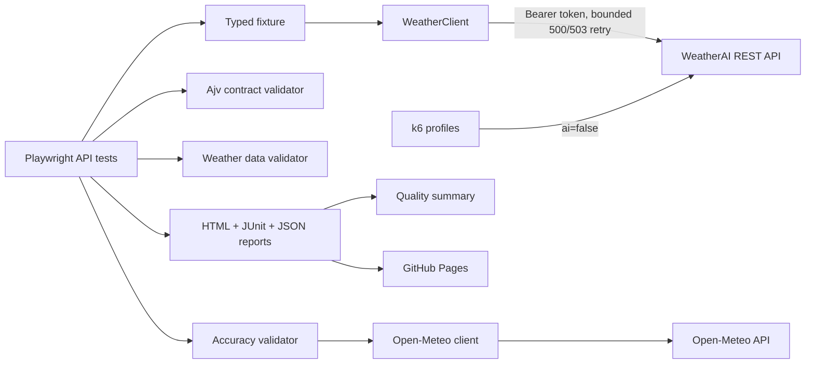

# weatherai-atmosguard

## Menu

- [weatherai-atmosguard](#weatherai-atmosguard)
  - [Menu](#menu)
  - [1. Overview](#1-overview)
  - [2. Objectives](#2-objectives)
  - [3. Architecture](#3-architecture)
  - [4. Technology stack](#4-technology-stack)
  - [5. APIs covered](#5-apis-covered)
  - [6. Test strategy](#6-test-strategy)
  - [7. Project structure](#7-project-structure)
  - [8. Prerequisites](#8-prerequisites)
  - [9. Installation](#9-installation)
  - [10. Environment configuration](#10-environment-configuration)
  - [11. Run all tests](#11-run-all-tests)
  - [12. Run individual suites](#12-run-individual-suites)
  - [13. Performance testing](#13-performance-testing)
  - [14. Reports](#14-reports)
  - [15. CI/CD](#15-cicd)
  - [16. GitHub Pages](#16-github-pages)
  - [17. API quota considerations](#17-api-quota-considerations)
  - [18. Engineering decisions](#18-engineering-decisions)
  - [19. Assumptions](#19-assumptions)
  - [20. Observed behavior and documentation discrepancies](#20-observed-behavior-and-documentation-discrepancies)
  - [21. Known limitations](#21-known-limitations)
  - [22. Future improvements](#22-future-improvements)

Supporting documents: [Test strategy](docs/TEST_STRATEGY.md) ·
[Automated test cases](docs/TEST_CASES.md)

## 1. Overview

`weatherai-atmosguard` is an API-only TypeScript quality engineering framework for the
[WeatherAI developer API](https://weather-ai.co/docs). Playwright's `APIRequestContext` drives
functional and synthetic checks, Ajv enforces tolerant JSON contracts, Open-Meteo provides an
independent anomaly signal, and k6 owns controlled performance testing.

## 2. Objectives

- Detect functional, authentication, authorization, contract, and boundary regressions.
- Validate weather-domain invariants and consistency across delegated endpoints.
- Identify material cross-provider divergence without claiming a reference provider is truth.
- Enforce candidate-defined latency budgets and provide quota-conscious synthetic monitoring.
- Produce human-readable and machine-readable evidence in local and CI execution.
- Separate API correctness testing from controlled load generation.

## 3. Architecture



## 4. Technology stack

- Node.js 20+
- TypeScript with strict, unchecked-index, exact-optional, and unused-symbol checks
- Playwright Test and `APIRequestContext`
- Ajv JSON Schema validation
- k6 load generation
- ESLint flat config and Prettier
- GitHub Actions, Pages, workflow artifacts, HTML, JUnit XML, and JSON reports

## 5. APIs covered

Authenticated WeatherAI coverage includes:

- `GET /v1/weather`
- `GET /v1/forecast`
- `GET /v1/current`
- `GET /v1/daily`
- `GET /v1/hourly`
- `GET /v1/weather-geo` and `GET /v1/usage` client support
- `GET /v1/forecast14` plan-aware authorization

The accuracy suite also calls Open-Meteo `GET /v1/forecast` for current temperature, relative
humidity, and wind-speed reference data. Humidity is compared only when WeatherAI exposes the
matching field.

## 6. Test strategy

Tests are data-driven and tagged `@smoke`, `@functional`, `@contract`, `@negative`, `@security`,
`@data-quality`, `@accuracy`, and `@monitoring`. Stable shape and domain rules are strict;
dynamic weather values use tolerances or invariants. Additional response properties are allowed
because the public API does not promise a closed contract.

The retry policy is deliberately narrow: at most three attempts with 500 ms and 1,000 ms delays,
only for HTTP `500` and `503`. It never retries `400`, `401`, `403`, assertions, or domain failures.
See [docs/TEST_STRATEGY.md](docs/TEST_STRATEGY.md) and
[docs/TEST_CASES.md](docs/TEST_CASES.md).

## 7. Project structure

```text
config/                    environment and candidate-defined thresholds
src/clients/               WeatherAI and Open-Meteo API clients
src/fixtures/              initialized Playwright WeatherClient fixture
src/models/                request/response/error types
src/schemas/               tolerant observed JSON Schemas
src/test-data/             precise global coordinates
src/utils/                 retry, timing, and redacting logger utilities
src/validators/            contract, domain, accuracy, error, and rate-limit rules
tests/                     functional API suites grouped by quality concern
performance/               k6 smoke/load/stress/spike profiles
scripts/                   evidence-based quality-summary generator
docs/                      strategy and automated case catalog
.github/workflows/         API CI, performance smoke, uptime, and Pages deployment
```

## 8. Prerequisites

- Node.js 20 or newer and npm
- A WeatherAI API key
- k6 1.x for local performance execution
- GitHub repository secret `WEATHER_AI_API_KEY` for live CI

## 9. Installation

```bash
git clone <repository-url>
cd weatherai-atmosguard
npm ci
```

`npm ci` is the supported deterministic install and is also used by CI.

## 10. Environment configuration

Copy `.env.example` to `.env` and replace only the placeholder:

```dotenv
WEATHER_AI_API_KEY=wai_your_key_here
WEATHER_AI_BASE_URL=https://api.weather-ai.co
WEATHER_AI_PLAN=free
```

`.env` and every `.env.*` variant except `.env.example` are ignored. The client reads the key only
from `process.env.WEATHER_AI_API_KEY`; the base URL defaults to `https://api.weather-ai.co`.
Supported plan values are `free`, `pro`, and `scale`.

Optional variables include `SMOKE_RESPONSE_BUDGET_MS`, `FUNCTIONAL_RESPONSE_BUDGET_MS`,
`MONITORING_RESPONSE_BUDGET_MS`, retry settings, and accuracy tolerances. Defaults live in
`config/thresholds.ts` and are candidate-defined quality gates—not WeatherAI production SLAs.

## 11. Run all tests

```bash
npm test
```

The safe default leaves AI validation skipped, sets `ai=false` on live calls, and does not execute
load/stress/spike profiles. Enable the two dedicated language/AI tests only when quota permits:

```bash
RUN_AI_TESTS=true npm run test:functional
```

In PowerShell use `$env:RUN_AI_TESTS='true'` before the npm command.

## 12. Run individual suites

```bash
npm run test:smoke
npm run test:functional
npm run test:contract
npm run test:negative
npm run test:data-quality
npm run test:consistency
npm run test:accuracy
npm run test:monitor
npm run lint
npm run typecheck
```

The Playwright tests use the exported fixture as `async ({ weatherClient }) => { ... }` and do not
duplicate authentication or raw URL construction.

## 13. Performance testing

The automatic profile makes exactly one request:

```bash
npm run perf:smoke
```

k6 receives `WEATHER_AI_API_KEY` and `WEATHER_AI_BASE_URL` from its process environment.
Load/stress/spike are manual and additionally require the explicit guard `ALLOW_HIGH_VOLUME=true`:

```bash
ALLOW_HIGH_VOLUME=true npm run perf:load
ALLOW_HIGH_VOLUME=true npm run perf:stress
ALLOW_HIGH_VOLUME=true npm run perf:spike
```

Only run them with API-owner authorization and sufficient quota. Every profile uses `ai=false`,
checks status and basic payload integrity, and applies candidate-defined failure-rate, p95, and p99
thresholds. Playwright is intentionally not used as a load generator.

## 14. Reports

Normal Playwright execution produces:

- `playwright-report/index.html`
- `test-results/results.xml`
- `test-results/results.json`

Open the HTML report with `npm run test:report`. Generate `quality-report.json` from an actual JSON
run with `npm run report:summary`. The summary derives pass/fail/skip counts, test-duration average
and p95, executed endpoints/locations, violation counts, and comparison attachment count. It never
invents missing measurements.

## 15. CI/CD

`.github/workflows/api-tests.yml` runs deterministic install, lint, type checking, each safe suite,
merged reporting, the quality summary, and the one-request k6 smoke. Blob reports preserve evidence
across separately visible suite steps. HTML and machine-readable results are downloadable artifacts.

Fork pull requests do not receive secrets. The workflow still runs static quality gates and safely
skips live API steps when `WEATHER_AI_API_KEY` is absent. AI tests remain opt-in in CI.

## 16. GitHub Pages

On a successful push to `main`, the merged `playwright-report/` is uploaded and deployed through
GitHub Pages. The resulting URL follows `https://<owner>.github.io/<repository>/` and is exposed by the deployment job.

## 17. API quota considerations

The Free plan documents 1,000 total and 200 AI requests per rolling 30-day subscription period.
Routine tests use `ai=false`; AI cases are explicit opt-ins. Daily monitoring makes one request.
The framework never attempts to exhaust quota to force `429`, and high-volume profiles cannot start
without a second authorization flag.

The absence of a `429` exhaustion test is currently intentional to avoid consuming the remaining monthly quota.

## 18. Engineering decisions

- **Playwright:** strong API contexts, fixtures, parallel-safe parameterization, steps, attachments,
  retries at the client boundary, and first-class HTML/JUnit reporting.
- **k6:** purpose-built VU scheduling and latency/failure-rate thresholds without misusing a
  functional runner for load.
- **Ajv:** fast, explicit JSON Schema checks with useful multi-error diagnostics.
- **`ai=false`:** prevents routine correctness checks from consuming scarce Gemini quota.
- **Tolerance-based reference checks:** forecast providers use different models and update cycles;
  exact equality would be scientifically and operationally unsound.
- **No automatic destructive load:** public quota and availability outweigh demonstration volume.
- **Environment-only secrets:** credentials stay in local environment files and GitHub Secrets;
  redacting logs provide a second defensive layer.

## 19. Assumptions

- `WEATHER_AI_PLAN` accurately describes the key under test.
- Metric WeatherAI wind speed and explicitly requested Open-Meteo wind speed are both km/h.
- Timestamp strings without offsets represent the requested location's local time; Open-Meteo uses
  `timezone=auto` to align them.
- Public weather values can change between sequential calls, so comparisons use stable fields and
  tolerances.

## 20. Observed behavior and documentation discrepancies

Evidence from low-volume requests on 2026-08-19 showed:

- Successful responses did not expose the documented `X-RateLimit-*` headers. Tests validate all
  three when present and fail on a partial/invalid set, but do not fail when the entire set is absent.
- `/v1/current`, `/v1/daily`, and `/v1/hourly` returned the same composite shape as `/v1/weather`,
  consistent with their documented shared handler rather than endpoint-specific reduced payloads.
- Latitude/longitude outside documented geographic bounds returned `502` with a generic upstream
  error, not `400`.
- Empty coordinate strings were coerced to zero and returned `200`.
- `days=0`, negative, oversized, and text values were normalized (`7`, `1`, `7`, and `7` in the
  observations) rather than rejected.
- A seven-day response contained seven daily rows but only 48 hourly rows. Domain checks therefore
  require the daily horizon and ensure returned hours are chronological and within that horizon;
  they do not assert `24 × days`.

These behaviors are tested as evidence, not presented as desirable API design.

## 21. Known limitations

- WeatherAI does not currently expose humidity in the sampled response, so cross-provider humidity
  comparison is conditional.
- No quota-exhaustion/`429` test runs against the shared public API.
- AI language behavior is not part of safe default execution.
- Forecast accuracy thresholds are anomaly heuristics, not meteorological acceptance guarantees.

## 22. Future improvements

- Run contract snapshots against a dedicated non-production tenant with versioned fixtures.
- Export timing and quality events to a time-series dashboard with alert routing.
- Add provider/model-aware accuracy baselines over rolling windows and seasons.
- Add a controlled mock/stub environment for deterministic `429`, `500`, and `503` verification.
