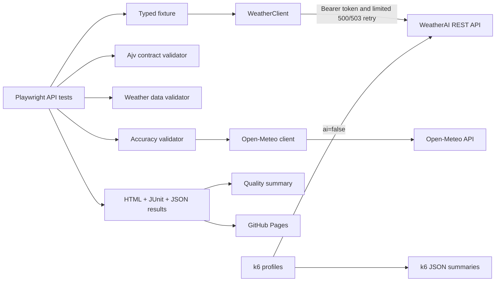

# WeatherAI AtmosGuard

[](https://github.com/Joseph-Mutua/weatherai-atmosguard/actions/workflows/api-tests.yml)
[](https://github.com/Joseph-Mutua/weatherai-atmosguard/actions/workflows/uptime-monitor.yml)

- [Live Playwright report](https://joseph-mutua.github.io/weatherai-atmosguard/)
- [CI runs](https://github.com/Joseph-Mutua/weatherai-atmosguard/actions)
- [WeatherAI documentation](https://weather-ai.co/docs)
- [Known issues](docs/KNOWN_ISSUES.md)

## Table of contents

- [What this project does](#what-this-project-does)
- [Project goals](#project-goals)
- [How it works](#how-it-works)
- [Tools used](#tools-used)
- [APIs covered](#apis-covered)
- [Testing approach](#testing-approach)
- [Project structure](#project-structure)
- [Requirements](#requirements)
- [Installation](#installation)
- [Environment setup](#environment-setup)
- [Running tests](#running-tests)
- [Performance tests](#performance-tests)
- [Reports](#reports)
- [CI/CD](#cicd)
- [GitHub Pages](#github-pages)
- [API quota safety](#api-quota-safety)
- [Why these tools and rules were chosen](#why-these-tools-and-rules-were-chosen)
- [Assumptions](#assumptions)
- [Observed API behavior](#observed-api-behavior)
- [Known limitations](#known-limitations)
- [Possible future improvements](#possible-future-improvements)

More details are available in the [test strategy](docs/TEST_STRATEGY.md),
[automated test cases](docs/TEST_CASES.md), and [known issues register](docs/KNOWN_ISSUES.md).

## What this project does

`weatherai-atmosguard` is a TypeScript test framework for the
[WeatherAI developer API](https://weather-ai.co/docs). It tests the API directly; it does not open
or automate a web browser.

The project uses:

- Playwright's `APIRequestContext` for functional API tests and small uptime checks.
- Ajv to check JSON response structures without rejecting valid extra fields.
- Open-Meteo as an independent comparison source for detecting large weather-data differences.
- k6 for controlled performance testing.

## Project goals

This project is designed to:

- Find functional, authentication, authorization, response-contract, and boundary errors.
- Check weather-data rules and consistency between related WeatherAI endpoints.
- Detect large differences between WeatherAI and another provider without assuming that either
  provider is always correct.
- Apply project-defined response-time limits and run uptime checks without wasting API quota.
- Create clear reports for people and machine-readable files for local and CI use.
- Keep normal correctness tests separate from load, stress, and spike tests.

## How it works



Playwright tests use a typed fixture that creates the `WeatherClient`. The client adds the bearer
token and uses a small, controlled retry policy. Validators then check the response structure,
weather data, errors, rate-limit information, and cross-provider differences. Test results are
saved as HTML, JUnit XML, and JSON.

## Tools used

- Node.js 20 or newer
- TypeScript with strict checking, including unchecked-index and exact-optional checks
- Playwright Test and `APIRequestContext`
- Ajv for JSON Schema validation
- k6 for performance tests
- ESLint flat config and Prettier
- GitHub Actions and GitHub Pages
- HTML, JUnit XML, JSON, and GitHub Actions artifacts for reporting

## APIs covered

Tests with a WeatherAI API key cover:

- `GET /v1/weather`
- `GET /v1/forecast`
- `GET /v1/current`
- `GET /v1/daily`
- `GET /v1/hourly`
- `GET /v1/weather-geo`, using fixed coordinates instead of the test runner's IP location
- `GET /v1/usage`, including its response structure and quota rules
- `GET /v1/forecast14`, with checks that depend on the configured plan

The accuracy tests also call Open-Meteo's `GET /v1/forecast` endpoint. They compare current
temperature, relative humidity, and wind speed. Humidity is compared only when WeatherAI includes
it in the response.

## Testing approach

Tests use data sets and the following tags:

- `@unit`
- `@smoke`
- `@functional`
- `@contract`
- `@negative`
- `@security`
- `@data-quality`
- `@accuracy`
- `@monitoring`

Stable response structures and weather-domain rules are checked strictly. Weather values that
naturally change are checked with ranges, tolerances, or general rules instead of exact values.
Extra response properties are allowed because the public API does not define a closed response
contract.

Retries are intentionally limited:

- A request can be attempted at most three times by default.
- The default delays are 500 ms and then 1,000 ms.
- Only HTTP `500` and `503` responses are retried.
- HTTP `400`, `401`, and `403` responses are not retried.
- Failed assertions and invalid weather data are not retried.
- The uptime test also requires `attempts === 1`. A request that succeeds only after a retry is not
  counted as uninterrupted uptime.

In CI, a test that passes on retry is still treated as a failure because `failOnFlakyTests` is
enabled. The quality report lists flaky tests and retry attempts separately, so instability remains
visible.

The response-time and accuracy limits are conservative project-defined regression checks. They are
meant to catch serious problems while allowing for normal internet and shared CI-runner variation.
They are not WeatherAI's official plan-specific service-level agreements (SLAs).

See [TEST_STRATEGY.md](docs/TEST_STRATEGY.md) and [TEST_CASES.md](docs/TEST_CASES.md) for the full
strategy and test list.

## Project structure

```text
config/                    Environment settings and project-defined limits
src/clients/               WeatherAI and Open-Meteo API clients
src/fixtures/              Playwright fixture that creates WeatherClient
src/models/                Request, response, and error types
src/schemas/               Flexible JSON Schemas based on observed responses
src/test-data/             Exact coordinates for locations around the world
src/utils/                 Retry, timing, and secret-redacting logging helpers
src/validators/            Contract, data, accuracy, error, and rate-limit checks
tests/                     API tests grouped by purpose
performance/               k6 smoke, load, stress, and spike profiles
k6-results/                Generated k6 summaries; only .gitkeep is tracked
scripts/                   Script that creates the quality summary
docs/                      Test strategy, test list, and known issues
.github/workflows/         CI, performance smoke, uptime, and Pages workflows
```

## Requirements

Before starting, install or obtain:

- Node.js 20 or newer and npm
- A WeatherAI API key
- k6 1.x if you want to run performance tests locally
- A GitHub repository secret named `WEATHER_AI_API_KEY` if you want CI to call the live API

## Installation

```bash
git clone https://github.com/Joseph-Mutua/weatherai-atmosguard.git
cd weatherai-atmosguard
npm ci
```

Use `npm ci` for a repeatable installation that exactly follows `package-lock.json`. CI uses the
same command.

## Environment setup

Copy `.env.example` to `.env`, then replace the example API key with a real key:

```dotenv
WEATHER_AI_API_KEY=wai_your_key_here
WEATHER_AI_BASE_URL=https://api.weather-ai.co
WEATHER_AI_PLAN=free
```

The API key is read only from `WEATHER_AI_API_KEY`. If `WEATHER_AI_BASE_URL` is not set, the client
uses `https://api.weather-ai.co`. `WEATHER_AI_PLAN` must be `free`, `pro`, or `scale` and defaults to
`free`.

The repository ignores `.env` and all other `.env.*` files except `.env.example`, which helps keep
secrets out of Git.

You can also set these optional variables:

| Variable                            |                      Default | Purpose                                           |
| ----------------------------------- | ---------------------------: | ------------------------------------------------- |
| `REFERENCE_WEATHER_BASE_URL`        | `https://api.open-meteo.com` | Open-Meteo base URL                               |
| `SMOKE_RESPONSE_BUDGET_MS`          |                       `5000` | Smoke-test response-time limit                    |
| `FUNCTIONAL_RESPONSE_BUDGET_MS`     |                       `8000` | Functional-test response-time limit               |
| `MONITORING_RESPONSE_BUDGET_MS`     |                       `5000` | Uptime-check response-time limit                  |
| `TRANSIENT_MAX_ATTEMPTS`            |                          `3` | Maximum attempts for retryable requests           |
| `TRANSIENT_INITIAL_DELAY_MS`        |                        `500` | First retry delay; later delays use backoff       |
| `ACCURACY_TEMPERATURE_TOLERANCE_C`  |                          `8` | Allowed temperature difference in degrees Celsius |
| `ACCURACY_HUMIDITY_TOLERANCE`       |                         `30` | Allowed humidity difference in percentage points  |
| `ACCURACY_WIND_SPEED_TOLERANCE_KMH` |                         `25` | Allowed wind-speed difference in km/h             |

These values must be positive numbers. They are project-defined quality limits, not WeatherAI
production SLAs.

## Running tests

### Run the safe default test set

```bash
npm test
```

By default, tests send `ai=false` during normal live API calls. The two language/AI tests are
skipped, and k6 load, stress, and spike profiles are not run.

To include the two AI summary tests when quota allows:

```bash
RUN_AI_TESTS=true npm run test:functional
```

PowerShell:

```powershell
$env:RUN_AI_TESTS='true'
npm run test:functional
```

### Run one test group

```bash
npm run test:unit
npm run test:smoke
npm run test:functional
npm run test:contract
npm run test:negative
npm run test:data-quality
npm run test:consistency
npm run test:accuracy
npm run test:monitor
```

### Run code-quality checks

```bash
npm run format:check
npm run lint
npm run typecheck
```

Playwright tests receive the shared client through the exported fixture:

```ts
async ({ weatherClient }) => {
  // Test code
};
```

This keeps authentication and raw request setup in one place instead of repeating them in every
test.

## Performance tests

The safe k6 smoke profile sends exactly one request:

```bash
npm run perf:smoke
```

k6 reads `WEATHER_AI_API_KEY` and `WEATHER_AI_BASE_URL` directly from its process environment.

The load, stress, and spike profiles send more traffic. They run only when
`ALLOW_HIGH_VOLUME=true` is set:

```bash
ALLOW_HIGH_VOLUME=true npm run perf:load
ALLOW_HIGH_VOLUME=true npm run perf:stress
ALLOW_HIGH_VOLUME=true npm run perf:spike
```

PowerShell example:

```powershell
$env:ALLOW_HIGH_VOLUME='true'
npm run perf:load
```

The error shown when this variable is missing is intentional. Set it only after the API owner has
approved the test and you have confirmed that enough quota is available.

Every k6 profile uses `ai=false` and checks:

- The returned coordinates match the request.
- The forecast length and units match the request.
- Current temperature and wind speed are finite numbers.
- Wind speed is not negative.
- Daily and hourly forecasts are not empty.

The one-request smoke profile uses a project-defined maximum latency of 5,000 ms. The longer
profiles use project-defined p95 and p99 latency limits, plus failure-rate and check-rate limits.
Each run creates `k6-results/<profile>-summary.json`.

Playwright is used for functional testing, not as a load generator.

## Reports

A normal Playwright run creates:

- `playwright-report/index.html`
- `test-results/results.xml`
- `test-results/results.json`

Each completed k6 profile creates:

- `k6-results/<profile>-summary.json`

Open the Playwright HTML report with:

```bash
npm run test:report
```

Create `quality-report.json` from a real Playwright JSON result with:

```bash
npm run report:summary
```

The quality summary reads the actual test evidence and reports:

- Passed, failed, skipped, and flaky test counts
- Retry attempts
- Average and p95 test duration
- Endpoints and locations that were tested
- Contract and data-quality violation counts
- Number of attached cross-provider comparisons

It does not create or guess measurements that are missing. Accuracy comparison evidence is
attached when tests pass and when a tolerance check fails.

## CI/CD

`.github/workflows/api-tests.yml` runs:

- `npm ci`
- Formatting, lint, and type checks
- Unit tests
- Every safe live API test group when a WeatherAI key is available
- Playwright report merging and the quality summary
- The one-request k6 smoke profile when a key is available

When a key is available, CI expects exactly eight Playwright blob reports: one unit-test report and
seven live-suite reports. If there is no key, it still merges and publishes the unit-test evidence.
The HTML report, machine-readable results, and k6 JSON summary are stored as downloadable GitHub
Actions artifacts.

The main quality workflow is the only automatic workflow that runs the one-request k6 smoke test.
The separate performance workflow can be started only by hand. This prevents a change to a
performance file from spending the same request twice.

A report-merge failure still fails CI. Evidence-building steps use `always()` where needed so useful
results can still be collected after an earlier test failure.

GitHub does not give repository secrets to pull requests from forks. Those pull requests still run
formatting, lint, type checking, and unit tests, but safely skip live API calls.

AI tests remain optional. They can be enabled with the `run_ai_tests` checkbox when the quality
workflow is started manually.

The uptime workflow runs once per day. It also runs when a push changes the uptime workflow or its
monitoring test. This creates an initial result for the uptime badge without spending quota on every
push.

## GitHub Pages

After a push to `main`, a successfully created merged `playwright-report/` is deployed to GitHub
Pages even if some API assertions failed. This keeps failure evidence available for review.

Deployment is skipped only when the report cannot be created or the live-test secret is not
available.

Live report: <https://joseph-mutua.github.io/weatherai-atmosguard/>

## API quota safety

The documented Free plan includes 1,000 total requests and 200 AI requests per rolling 30-day
subscription period.

To protect that quota:

- Normal tests use `ai=false`.
- AI tests must be enabled explicitly.
- Daily monitoring sends one request.
- The project does not exhaust the quota to force an HTTP `429` response.
- High-volume profiles cannot start without the extra `ALLOW_HIGH_VOLUME=true` flag.

The missing `429` quota-exhaustion test is a deliberate safety choice. Running it against the
shared public API could use all remaining monthly quota.

## Why these tools and rules were chosen

- **Playwright:** It provides API request contexts, typed fixtures, data-driven tests, steps,
  attachments, and built-in HTML and JUnit reporting.
- **k6:** It provides virtual-user scheduling and latency/failure-rate limits designed for load
  testing.
- **Ajv:** It checks clear JSON Schemas and reports multiple contract errors while still allowing
  extra fields.
- **`ai=false`:** Normal checks do not spend the limited Gemini/AI request allowance.
- **Tolerance-based provider comparisons:** Weather providers use different models and update
  schedules, so exact matching would not be scientifically or operationally reliable.
- **No automatic high-volume load:** Protecting public quota and service availability is more
  important than automatically generating demonstration traffic.
- **Environment-only secrets:** API keys stay in local environment files and GitHub Secrets. Logs
  also redact sensitive values as an extra safety layer.

## Assumptions

- `WEATHER_AI_PLAN` correctly describes the plan connected to the API key being tested.
- WeatherAI metric wind speed and the explicitly requested Open-Meteo wind speed are both in km/h.
- A timestamp without a timezone offset represents local time for the requested location.
  Open-Meteo uses `timezone=auto` to align the comparison.
- Public weather data can change between two requests, so endpoint comparisons use stable fields
  and reasonable tolerances.

## Observed API behavior

Low-volume requests made on 2026-08-19 showed the following behavior:

- Successful responses did not include any documented `X-RateLimit-*` headers. Tests require a
  complete and valid header set if any of these headers appears, but do not fail when all of them
  are missing.
- `/v1/current`, `/v1/daily`, and `/v1/hourly` returned the same combined response structure as
  `/v1/weather`. This matches the documented use of a shared handler.
- Coordinates outside normal geographic limits returned `502` with a general upstream error
  instead of `400`.
- Empty coordinate strings were changed to zero and returned `200`.
- Values of `days=0`, a negative number, an oversized number, and text were changed to `7`, `1`,
  `7`, and `7` respectively.
- A seven-day response contained seven daily records but only 48 hourly records. Tests check that
  timestamps are ordered and fall inside the daily forecast period; they do not assume there must
  be `24 x days` hourly records.

These findings describe evidence, not behavior that this project recommends. Current status, risk,
and automated checks are recorded in [docs/KNOWN_ISSUES.md](docs/KNOWN_ISSUES.md).

## Known limitations

- WeatherAI did not return humidity in the sampled response, so humidity is compared with
  Open-Meteo only when WeatherAI provides it.
- The shared public API is not used for a quota-exhaustion or `429` test.
- AI language behavior is not part of the safe default test run.
- Forecast accuracy limits are warning signals for unusual differences, not guarantees of
  meteorological accuracy.
- If Open-Meteo is unavailable, accuracy comparison tests can be affected.

## Possible future improvements

- Test contract snapshots in a separate non-production account using versioned fixtures.
- Send timing and quality events to a time-series dashboard with alerts.
- Build provider- and model-specific accuracy baselines that cover rolling time windows and
  seasons.
- Add a controlled mock environment for repeatable `429`, `500`, and `503` tests.
- Add an approved CI matrix that tests Free, Pro, and Scale plans.
